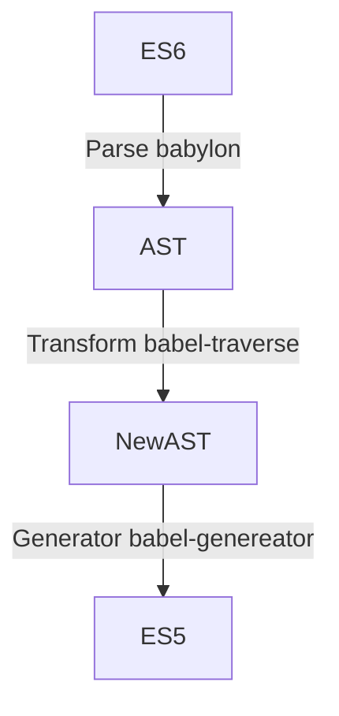

# Babel

Babel is a compiler for writing next generation JavaScript.

Babel 是一个可以编写下一代 JavaScript 的编译器



- core-js

> core-js 2 3

```
[
  '@babel/env',
  {
    targets: {
    ...
    corejs: 'core-js@2'
  }
]
```

https://stackoverflow.com/questions/55251983/what-does-this-error-mean-with-usebuiltins-option-required-direct-setting-of

[babel 7.8.0](https://babeljs.io/blog/2020/01/11/7.8.0)

- nullish coalescing (??)
- optional chaining (?.)
- dynamic import()

> package.json

```
  "devDependencies": {
     "@babel/core": "^7.8.6",
     "@babel/plugin-proposal-class-properties": "^7.8.3",
-    "@babel/plugin-syntax-dynamic-import": "^7.8.3",
```

> .babelrc

```
  "plugins": [
-    "@babel/plugin-syntax-dynamic-import",
    [
```
